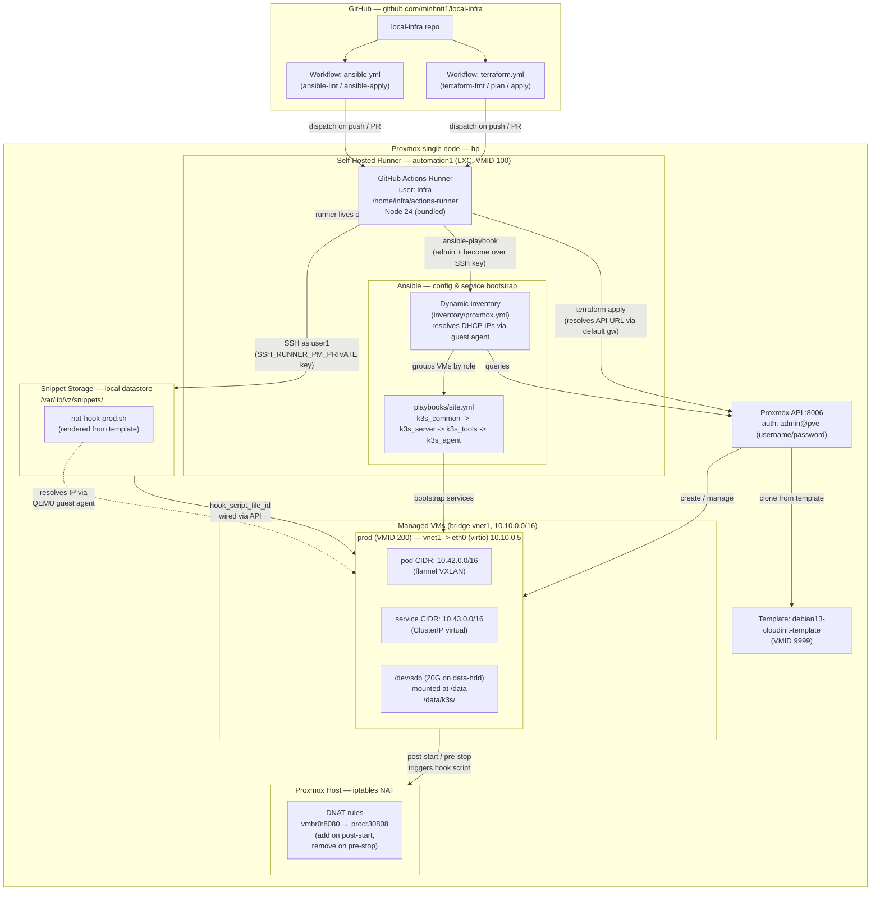

# local-infra

Repository to manage the infrastructure (helm, ansible, terraform, k8s) of the lab. The entire infra runs on a Proxmox single-node host

- **Base branch**: `main`

---

## Deployment Overview

High-level view of how the `local-infra` repo drives the lab and where each component lives.



**Key points**
- Workflows run on the **self-hosted runner** inside the lab (not GitHub-hosted) so `terraform-apply` can reach the Proxmox API on the private network.
- The runner resolves the Proxmox API URL from its **default gateway** (the Proxmox host IP on `vnet1`).
- **VM port forwarding (NAT iptables):** VMs with `forwards` entries in `var.vms` automatically get a hook script uploaded to `/var/lib/vz/snippets/` via SSH (as `user1` using `SSH_RUNNER_PM_PRIVATE` key). The script is wired to the VM via `hook_script_file_id`, and on VM start/stop it manages DNAT rules on the Proxmox host — with dynamic IP resolution via the QEMU guest agent.

---

## Project Layout

```
local-infra/
├── .github/
│   └── workflows/
│       ├── ansible.yml        # Ansible lint + apply CI
│       └── terraform.yml      # Terraform fmt / plan / apply CI
├── ansible/                   # Configuration management & service bootstrap
│   ├── ansible.cfg            # Default inventory, remote_user=admin + become
│   ├── inventory/
│   │   ├── proxmox.yml        # Dynamic Proxmox inventory (DHCP IP resolution)
│   │   └── group_vars/
│   │       └── all.yml        # Shared vars (k3s version, token placeholder)
│   ├── playbooks/
│   │   └── site.yml           # Orchestrates common -> server -> tools -> agents
│   └── roles/
│       ├── k3s_common/        # Shared prereqs (swap, kernel modules, sysctl, apt)
│       ├── k3s_server/        # Install k3s control-plane, fetch kubeconfig
│       ├── k3s_tools/         # Install Helm CLI and ArgoCD after k3s
│       └── k3s_agent/         # Join workers to the server (no-op while empty)
├── argocd/                    # ArgoCD App of Apps definitions
│   └── apps/                  # Child Application CRDs (dev, prod)
├── helm/                      # Helm charts for lab services
│   ├── fluentbit/             # Fluent Bit log shipper
│   ├── loki/                  # Loki log storage
│   ├── mysql/                 # MySQL
│   └── prometheus/            # Prometheus metrics
└── terraform/                 # Proxmox VM provisioning
    ├── backend.tf             # Remote state config
    ├── imports.tf             # Imported resources
    ├── main.tf                # VM resources + NAT hook scripts
    ├── outputs.tf             # VM IDs, names, IPs, MACs
    ├── providers.tf           # Proxmox + SSH provider config
    ├── templates/
    │   └── nat-hook.sh.tpl    # Per-VM iptables NAT hook template
    ├── terraform.tfvars.example # Example variables (no secrets)
    └── variables.tf           # All input variables + VM specs
```

## Component Documentation

- [Terraform: Proxmox VM Provisioning](./terraform/README.md)
- [Self-Hosted GitHub Runner](./.github/workflows/README.md)
- [Ansible: Configuration & Service Bootstrap](./ansible/README.md)
- [Monitoring Stack](./helm/README.md)
- [ArgoCD](./argocd/README.md)
