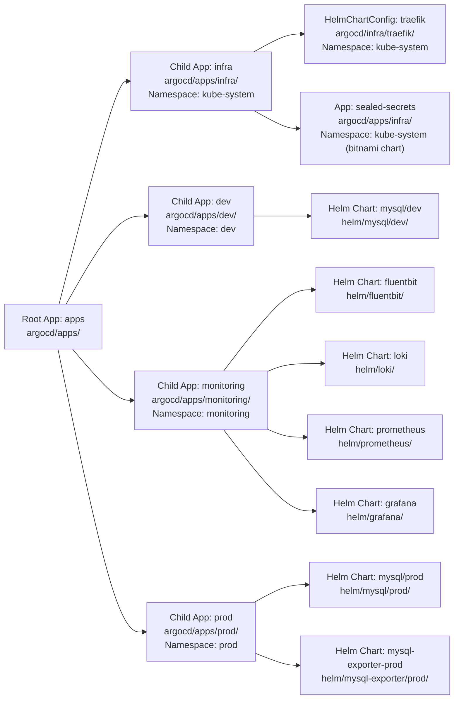

# ArgoCD

## Architecture — App of Apps Pattern

ArgoCD uses the **App of Apps** pattern to manage workloads declaratively. A single root Application (`apps`) watches the `argocd/apps/` directory in the repo and creates child Applications based on the YAML manifests found there.

## App Overview



| Child App | ArgoCD Path | Namespace | Helm Chart Source |
|-----------|-------------|-----------|-------------------|
| `infra` | `argocd/apps/infra/` | `kube-system` | `argocd/infra/traefik/` (HelmChartConfig), `sealed-secrets-app.yaml` (bitnami Helm chart) |
| `dev` | `argocd/apps/dev/` | `dev` | `helm/mysql/dev/` |
| `monitoring` | `argocd/apps/monitoring/` | `monitoring` | `helm/fluentbit/`, `helm/loki/`, `helm/prometheus/`, `helm/grafana/` |
| `prod` | `argocd/apps/prod/` | `prod` | `helm/mysql/prod/`, `helm/mysql-exporter/prod/` |

## Applications

| App | Branch | Path | Namespace | Sync Policy |
|-----|--------|------|-----------|-------------|
| `apps` (root) | `main` | `argocd/apps/` (recursive) | `argocd` | Automated + Prune |
| `infra` | `main` | `argocd/apps/infra/` | `argocd` | Automated + Prune |
| `traefik-config` | `main` | `argocd/apps/infra/` | `kube-system` | Automated + Prune |
| `sealed-secrets` | `main` | `argocd/apps/infra/` | `kube-system` | Automated + Prune |
| `mysql-dev` | `main` | `argocd/apps/dev/` | `dev` | Automated + Prune |
| `fluentbit` | `main` | `argocd/apps/monitoring/` | `monitoring` | Automated + Prune |
| `loki` | `main` | `argocd/apps/monitoring/` | `monitoring` | Automated + Prune |
| `prometheus` | `main` | `argocd/apps/monitoring/` | `monitoring` | Automated + Prune |
| `grafana` | `main` | `argocd/apps/monitoring/` | `monitoring` | Automated + Prune |
| `mysql-prod` | `main` | `argocd/apps/prod/` | `prod` | Automated + Prune |
| `mysql-exporter-prod` | `main` | `argocd/apps/prod/` | `prod` | Automated + Prune |

## Secrets Management (Sealed Secrets)

The [Sealed Secrets](https://github.com/bitnami/sealed-secrets) controller runs in `kube-system`, deployed by the `sealed-secrets` ArgoCD app from `argocd/apps/infra/sealed-secrets-app.yaml` (bitnami chart `2.19.1`, `fullnameOverride=sealed-secrets-controller` so `kubeseal` works without extra flags). It lets us commit encrypted `Secret` data to git safely — only the controller can decrypt it.

**Rule:** Never commit raw credentials (GitHub PATs, DB passwords) to this repo — **not even base64-encoded**. GitHub push protection decodes base64 and blocks `ghp_…` tokens. Use Sealed Secrets (in-cluster) or GitHub Actions secrets (CI) instead.

**Workflow to add/update a secret:**
1. Install `kubeseal` locally.
2. Build a normal `Secret` and pipe it through `kubeseal` to produce a `SealedSecret`:
   ```bash
   kubectl -n <namespace> create secret docker-registry <name> \
     --docker-server=ghcr.io --docker-username=minhntt1 \
     --docker-password=<PAT> --dry-run=client -o json \
     | kubeseal -n <namespace> --name <name> -o yaml > sealedsecret-<name>.yaml
   ```
3. Commit the generated `sealedsecret-*.yaml`. The controller decrypts it in-cluster into the `Secret` of the same name/namespace.

**Convention for network-statistics:** the charts expect Secrets produced by SealedSecrets (the charts set `imagePullSecret.enabled: false` and reference the secret directly):
- `dockerconfigjson` pull secret named after the chart fullname — `<chart-fullname>-ghcr-secret` in `dev` / `prod` (the `<chart-fullname>` equals the ArgoCD Application/release name, e.g. `netstat-statistics-dev-ghcr-secret`).
- DB passwords in a generic secret `<chart-fullname>-db-secret` with keys `quartz-scheduler-password` and `statistic-db-password`.
  > The chart's `ConfigMap` currently embeds the DB password (decoded from a base64 value in `values.yaml`). For proper isolation, move to `env: valueFrom: secretKeyRef` against this Sealed Secret instead.

**GitHub Actions secrets** (e.g. `LOCAL_INFRA_PAT` on the `netstat-statistics` repo) live in GitHub's secret store and are never committed to this repo.

## Status (verified via ArgoCD CLI)

| Component | Status |
|-----------|--------|
| **Server** | Running at `10.10.0.5:30808` (k3s prod VM) |
| **ArgoCD Server Version** | `v3.1.0` (Kustomize v5.7.0, Helm v3.18.4, Kubectl v0.33.1) |
| **ArgoCD CLI Version** | `v3.4.5` |
| **Authentication** | Logged in as `admin` via `admin` issuer |
| **Applications** | `apps` (root), `sealed-secrets` (controller, deployed via #61), plus per-env apps (`mysql-*`, `grafana`, etc.) — synced via the root `apps` app |
| **Clusters** | **1** — `in-cluster` (`https://kubernetes.default.svc`) |
| **Repositories** | **1** — `local-infra` (`https://github.com/minhntt1/local-infra`) — **Successful** |
| **Projects** | **1** — `default` (wildcard destinations/sources, orphaned resources disabled) |

**Key observations:**
- ArgoCD is operational and accessible on the prod k3s cluster (`10.10.0.5:30808`)
- The `local-infra` git repo is connected and fetching successfully
- All applications use automated sync with prune, but self-heal is disabled

> **✅ Resolved (2026-07-27):** A second, full ArgoCD install was previously running in the **`default`** namespace (7 `argocd-*` pods, image `v3.4.5`, ClusterIP only — no nodePort, so it never bound host port 30808). It was unmanaged (no Helm release, no Application CR, empty config) and redundant vs the intended Helm-managed install in the `argocd` namespace. It has been **deleted** (all workloads, services, RBAC in `default`, plus cluster-wide `argocd-*` ClusterRoles/Bindings). The intended `argocd`-ns instance (image `v3.1.0`) remains and still serves port 30808.
