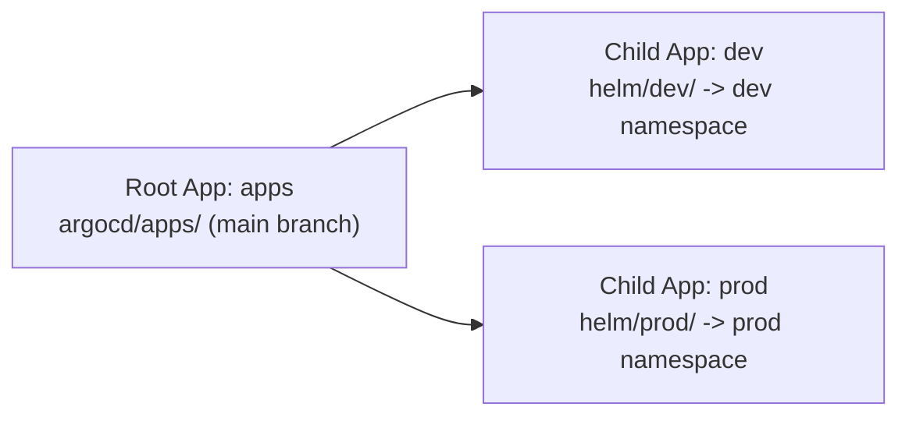

# ArgoCD

## Architecture — App of Apps Pattern

ArgoCD uses the **App of Apps** pattern to manage workloads declaratively. A single root Application (`apps`) watches the `argocd/apps/` directory in the repo and creates child Applications based on the YAML manifests found there.



## Repository Layout

```
local-infra/
├── argocd/
│   └── apps/
│       ├── dev-app.yaml      # Application CRD for dev
│       └── prod-app.yaml     # Application CRD for prod
├── helm/
│   ├── dev/                  # Helm chart deployed to dev namespace
│   │   ├── Chart.yaml
│   │   ├── values.yaml
│   │   └── templates/
│   │       ├── deployment.yaml
│   │       └── service.yaml
│   └── prod/                 # Helm chart deployed to prod namespace
│       ├── Chart.yaml
│       ├── values.yaml
│       └── templates/
│           ├── deployment.yaml
│           └── service.yaml
```

## Applications

| App | Branch | Path | Namespace | Sync Policy | Resources Created |
|-----|--------|------|-----------|-------------|-------------------|
| `apps` (root) | `main` | `argocd/apps/` (recursive) | `argocd` | Automated + Prune + SelfHeal | Dev + Prod child Applications |
| `dev` | `main` | `helm/dev/` | `dev` | Automated + Prune + SelfHeal | Namespace `dev`, Deployment `dev-local-infra-dev`, Service `dev-local-infra-dev` |
| `prod` | `main` | `helm/prod/` | `prod` | Automated + Prune + SelfHeal | Namespace `prod`, Deployment `prod-local-infra-prod`, Service `prod-local-infra-prod` |

## Status (verified via ArgoCD CLI)

| Component | Status |
|-----------|--------|
| **Server** | Running at `10.10.0.5:30808` (k3s prod VM) |
| **ArgoCD Server Version** | `v3.1.0` (Kustomize v5.7.0, Helm v3.18.4, Kubectl v0.33.1) |
| **ArgoCD CLI Version** | `v3.4.5` |
| **Authentication** | Logged in as `admin` via `admin` issuer |
| **Applications** | **3** — `apps` (root), `dev`, `prod` — all **Synced** and **Healthy** |
| **Clusters** | **1** — `in-cluster` (`https://kubernetes.default.svc`) |
| **Repositories** | **1** — `local-infra` (`https://github.com/minhntt1/local-infra`) — **Successful** |
| **Projects** | **1** — `default` (wildcard destinations/sources, orphaned resources disabled) |

**Key observations:**
- ArgoCD is operational and accessible on the prod k3s cluster (`10.10.0.5:30808`)
- The `local-infra` git repo is connected and fetching successfully
- Both `dev` and `prod` namespaces are auto-created by ArgoCD via `CreateNamespace=true`
- Both deployments run nginx:stable-alpine as a placeholder — ready for real workloads
- All 3 applications use automated sync with prune and self-heal enabled

> **✅ Resolved (2026-07-27):** A second, full ArgoCD install was previously running in the **`default`** namespace (7 `argocd-*` pods, image `v3.4.5`, ClusterIP only — no nodePort, so it never bound host port 30808). It was unmanaged (no Helm release, no Application CR, empty config) and redundant vs the intended Helm-managed install in the `argocd` namespace. It has been **deleted** (all workloads, services, RBAC in `default`, plus cluster-wide `argocd-*` ClusterRoles/Bindings). The intended `argocd`-ns instance (image `v3.1.0`) remains and still serves port 30808.
