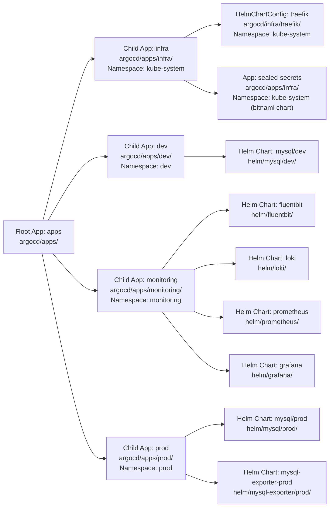

# ArgoCD

## Architecture — App of Apps Pattern

ArgoCD uses the **App of Apps** pattern to manage workloads declaratively. A single root Application (`apps`) watches the `argocd/apps/` directory in the repo and creates child Applications based on the YAML manifests found there.

## App Overview



| Child App | ArgoCD Path | Namespace | Helm Chart Source |
|-----------|-------------|-----------|-------------------|
| `infra` | `argocd/apps/infra/` | `kube-system` | `argocd/infra/traefik/` (HelmChartConfig), `sealed-secrets-app.yaml` (bitnami Helm chart) |
| `dev` | `argocd/apps/dev/` | `dev` | `helm/mysql/dev/` |
| `monitoring` | `argocd/apps/monitoring/` | `monitoring` | `helm/fluentbit/`, `helm/loki/`, `helm/prometheus/`, `helm/grafana/` |
| `prod` | `argocd/apps/prod/` | `prod` | `helm/mysql/prod/`, `helm/mysql-exporter/prod/` |

## Applications

| App | Branch | Path | Namespace | Sync Policy |
|-----|--------|------|-----------|-------------|
| `apps` (root) | `main` | `argocd/apps/` (recursive) | `argocd` | Automated + Prune |
| `infra` | `main` | `argocd/apps/infra/` | `argocd` | Automated + Prune |
| `traefik-config` | `main` | `argocd/apps/infra/` | `kube-system` | Automated + Prune |
| `sealed-secrets` | `main` | `argocd/apps/infra/` | `kube-system` | Automated + Prune |
| `mysql-dev` | `main` | `argocd/apps/dev/` | `dev` | Automated + Prune |
| `fluentbit` | `main` | `argocd/apps/monitoring/` | `monitoring` | Automated + Prune |
| `loki` | `main` | `argocd/apps/monitoring/` | `monitoring` | Automated + Prune |
| `prometheus` | `main` | `argocd/apps/monitoring/` | `monitoring` | Automated + Prune |
| `grafana` | `main` | `argocd/apps/monitoring/` | `monitoring` | Automated + Prune |
| `mysql-prod` | `main` | `argocd/apps/prod/` | `prod` | Automated + Prune |
| `mysql-exporter-prod` | `main` | `argocd/apps/prod/` | `prod` | Automated + Prune |

## Onboarding Sealed Secrets — Step by Step

Every chart that needs credentials must use [Sealed Secrets](https://github.com/bitnami/sealed-secrets) to store them. The controller (bitnami chart `2.19.1`, `fullnameOverride=sealed-secrets-controller`) runs in `kube-system` and decrypts `SealedSecret` resources in-cluster so no plaintext secrets are ever committed to git.

The **`seal-secret`** skill ships `seal.sh` — a reusable script that encrypts any `Secret` JSON into a commit-safe `SealedSecret`. The script has `KUBECONFIG` built in and auto-fetches the controller public cert; sealing is local encryption with zero cluster writes.

### Hard rules
- **NEVER commit raw credentials**, not even base64-encoded. GitHub push protection decodes base64 and blocks `ghp_…` tokens.
- **Every secret must be a SealedSecret in the chart's `templates/`** — the controller creates the resultant `Secret`.
- **Helm must NOT create the same Secret**: guard the Helm-managed `secret.yaml` template behind a flag or remove it.
- **GitHub Actions tokens** (e.g. `LOCAL_INFRA_PAT`) live in GitHub's secret store, never in this repo.
- Reference implementation: `helm/network-statistics/` (PRs #60, #67).

---

### Step 1 — Build the plaintext Secret manifest (local, client-side)

Create a JSON file describing the `Secret` your application needs. Use `kubectl --dry-run=client` (no API call) or write the JSON directly.

**Example — Docker registry pull secret (GHCR):**
```bash
# Read the PAT from a file (never put it on the CLI)
PW=$(printf '%s' "$(cat temp/ghcr_pat.txt)" | base64 -d)
AUTH=$(printf '%s:%s' USERNAME "$PW" | base64 -w0)
CONFIG=$(printf '{"auths":{"ghcr.io":{"username":"USERNAME","password":"%s","auth":"%s"}}}' "$PW" "$AUTH")
DOCKERCFG=$(printf '%s' "$CONFIG" | base64 -w0)
printf '{"apiVersion":"v1","kind":"Secret","metadata":{"name":"MYAPP-ghcr-secret","namespace":"NAMESPACE"},"type":"kubernetes.io/dockerconfigjson","data":{".dockerconfigjson":"%s"}}' \
  "$DOCKERCFG" > temp/ghcr-secret.json
```

**Example — Generic Opaque secret (DB passwords, API keys):**
```bash
printf '{"apiVersion":"v1","kind":"Secret","metadata":{"name":"MYAPP-db-secret","namespace":"NAMESPACE"},"type":"Opaque","stringData":{"password":"PASSWORD","api-key":"KEY"}}' \
  > temp/db-secret.json
```

> Keep the password **out of the command line** — read it from a local file or type it into a variable.

---

### Step 2 — Seal it with `seal.sh`

Load the `seal-secret` skill, then:
```bash
seal.sh <namespace> <secret-name> <secret-manifest-json> <chart-templates-path>/sealedsecret-<name>.yaml
```

Real example (network-statistics GHCR dev):
```bash
seal.sh dev network-statistics-dev-ghcr-secret temp/ghcr-secret.json \
  helm/network-statistics/dev/templates/sealedsecret-ghcr.yaml
```

The `seal.sh` script:
- Auto-fetches the controller's public certificate (`temp/k3s/sealed-cert.pem`) if missing (one-time, needs KUBECONFIG — the script exports it).
- Encrypts **locally** — no plaintext reaches the cluster.
- Outputs a `SealedSecret` YAML ready to commit.

---

### Step 3 — Commit the `SealedSecret` YAML as a Helm template

Drop the generated file into your chart's `templates/` directory. Helm will render it verbatim; the controller creates the `Secret` of the same `name`/`namespace` in-cluster.

**Example — the `sealedsecret-db.yaml` template (no Helm logic needed):**
```
---
apiVersion: bitnami.com/v1alpha1
kind: SealedSecret
metadata:
  name: MYAPP-db-secret
  namespace: NAMESPACE
spec:
  encryptedData:
    password: AgB8SX7aWF...
  template:
    metadata:
      name: MYAPP-db-secret
      namespace: NAMESPACE
    type: Opaque
```

---

### Step 4 — Wire the deployment to use `secretKeyRef`

Your deployment **must not mount the Secret as a volume**. Instead, inject individual values as environment variables via `secretKeyRef`. This is how Spring Boot, Node, Python, etc. pick them up without a ConfigMap.

```yaml
env:
  - name: DB_PASSWORD
    valueFrom:
      secretKeyRef:
        name: MYAPP-db-secret
        key: password
  - name: API_KEY
    valueFrom:
      secretKeyRef:
        name: MYAPP-db-secret
        key: api-key
```

For **GHCR pull secrets**, the deployment references the secret by name in `spec.template.spec.imagePullSecrets` — no env var needed.

---

### Step 5 — Disable the Helm-managed Secret (avoid conflicts)

If your chart has a `templates/secret.yaml` that creates a `Secret` from `values.yaml` plaintext, guard it so Helm doesn't create a `Secret` with the same name the `SealedSecret` expects.

```yaml
{{- if not .Values.secrets.useSealed }}
apiVersion: v1
kind: Secret
...
{{- end }}
```

Add the flag to `values.yaml`:
```yaml
secrets:
  useSealed: true
```

Or simply delete the `secret.yaml` template and rely entirely on the `SealedSecret`.

---

### Step 6 — Validate

```bash
# Validate the ciphertext against the controller (needs KUBECONFIG)
kubeseal --validate -f templates/sealedsecret-db.yaml

# Render and verify nothing clashes
helm template RELEASE ./chart | grep -E "kind:|secretKeyRef"

# After ArgoCD syncs
kubectl -n NAMESPACE get secret MYAPP-db-secret
```

---

### Troubleshooting

| Symptom | Likely cause | Fix |
|---------|-------------|-----|
| `UnknownHostException: mysql1` | JAR-internal profile-specific `.properties` takes precedence over ConfigMap | Use env vars (`secretKeyRef`) instead of ConfigMap properties files |
| `ImagePullBackOff` | GHCR pull secret missing or wrong type | Verify `SealedSecret` has `template.type: kubernetes.io/dockerconfigjson` |
| Pod sees wrong password | Helm `secret.yaml` is still creating a conflicting `Secret` with old values | Set `secrets.useSealed: true` or delete the template |
| `SealedSecret` renders but no `Secret` appears | Controller isn't running, or `SealedSecret` `name`/`namespace` doesn't match the deployment reference | `kubectl -n kube-system get pods -l app.kubernetes.io/name=sealed-secrets` |

### Real-world reference

- `helm/network-statistics/dev/templates/sealedsecret-ghcr.yaml` — GHCR pull secret (dockerconfigjson)
- `helm/network-statistics/dev/templates/sealedsecret-db.yaml` — DB passwords (Opaque, consumed via `secretKeyRef` env vars)
- `helm/network-statistics/dev/templates/secret.yaml` — Helm-managed secret, guarded behind `database.useSealed`
- `helm/network-statistics/dev/templates/deployment-admin.yaml` — deployment wiring (`valueFrom.secretKeyRef`)
- `.kilo/skills/seal-secret/` — the `seal-secret` skill + `seal.sh` script

## Status (verified via ArgoCD CLI)

| Component | Status |
|-----------|--------|
| **Server** | Running at `10.10.0.5:30808` (k3s prod VM) |
| **ArgoCD Server Version** | `v3.1.0` (Kustomize v5.7.0, Helm v3.18.4, Kubectl v0.33.1) |
| **ArgoCD CLI Version** | `v3.4.5` |
| **Authentication** | Logged in as `admin` via `admin` issuer |
| **Applications** | `apps` (root), `sealed-secrets` (controller, deployed via #61), plus per-env apps (`mysql-*`, `grafana`, etc.) — synced via the root `apps` app |
| **Clusters** | **1** — `in-cluster` (`https://kubernetes.default.svc`) |
| **Repositories** | **1** — `local-infra` (`https://github.com/minhntt1/local-infra`) — **Successful** |
| **Projects** | **1** — `default` (wildcard destinations/sources, orphaned resources disabled) |

**Key observations:**
- ArgoCD is operational and accessible on the prod k3s cluster (`10.10.0.5:30808`)
- The `local-infra` git repo is connected and fetching successfully
- All applications use automated sync with prune, but self-heal is disabled

> **✅ Resolved (2026-07-27):** A second, full ArgoCD install was previously running in the **`default`** namespace (7 `argocd-*` pods, image `v3.4.5`, ClusterIP only — no nodePort, so it never bound host port 30808). It was unmanaged (no Helm release, no Application CR, empty config) and redundant vs the intended Helm-managed install in the `argocd` namespace. It has been **deleted** (all workloads, services, RBAC in `default`, plus cluster-wide `argocd-*` ClusterRoles/Bindings). The intended `argocd`-ns instance (image `v3.1.0`) remains and still serves port 30808.
