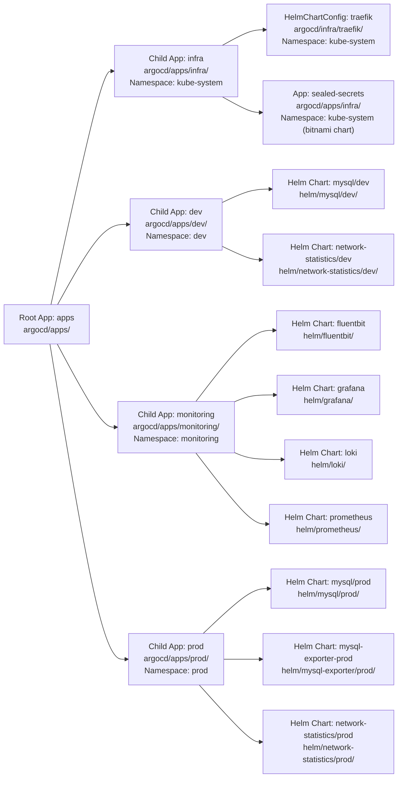

# ArgoCD

## Layout

```
argocd/
├── README.md                         # This file
├── apps/                             # ArgoCD Application CRDs (App of Apps)
│   ├── infra/                        # Infrastructure apps (sealed-secrets, traefik-config)
│   ├── dev/                          # Dev environment apps (mysql, network-statistics)
│   ├── monitoring/                   # Monitoring apps (fluentbit, grafana, loki, prometheus)
│   └── prod/                         # Prod environment apps (mysql, mysql-exporter, network-statistics)
└── infra/
    └── traefik/                      # Traefik HelmChartConfig
        └── helmchartconfig.yaml
```

## Architecture — App of Apps Pattern

ArgoCD uses the **App of Apps** pattern to manage workloads declaratively. A single root Application (`apps`) watches the `argocd/apps/` directory in the repo and creates child Applications based on the YAML manifests found there.

## App Overview



| Child App | ArgoCD Path | Namespace | Helm Chart Source |
|-----------|-------------|-----------|-------------------|
| `infra` | `argocd/apps/infra/` | `kube-system` | `argocd/infra/traefik/` (HelmChartConfig), `sealed-secrets-app.yaml` (bitnami Helm chart) |
| `dev` | `argocd/apps/dev/` | `dev` | `helm/mysql/dev/`, `helm/network-statistics/dev/` |
| `monitoring` | `argocd/apps/monitoring/` | `monitoring` | `helm/fluentbit/`, `helm/loki/`, `helm/prometheus/`, `helm/grafana/` |
| `prod` | `argocd/apps/prod/` | `prod` | `helm/mysql/prod/`, `helm/mysql-exporter/prod/`, `helm/network-statistics/prod/` |

## Secrets Management (Sealed Secrets)

[Sealed Secrets](https://github.com/bitnami/sealed-secrets) encrypts Kubernetes `Secret` data into commit-safe `SealedSecret` manifests. The controller (bitnami chart `2.19.1`, `fullnameOverride=sealed-secrets-controller`) runs in `kube-system` and decrypts them in-cluster.

**Hard rules:**
- **NEVER commit raw or base64-encoded credentials** — GitHub push protection decodes base64 and blocks `ghp_…` tokens.
- **GitHub Actions tokens** (e.g. `LOCAL_INFRA_PAT`) stay in GitHub's store, never in this repo.
- **Use the `seal-secret` skill** (`seal.sh`) to seal — the skill has `KUBECONFIG` built in and auto-fetches the public cert; sealing is local encryption with zero cluster writes.

> **Step-by-step onboarding guide:** [sealed-secrets-onboard.md](../docs/sealed-secrets-onboard.md)

Reference implementation: `helm/network-statistics/` (PRs #60, #67).

## How to Add a New App

See the step-by-step guide: [docs/create-argocd-app-guide.md](../docs/create-argocd-app-guide.md).
